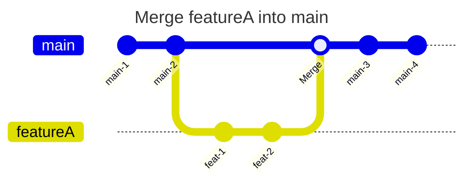

---
tags:
  - panel/3
---
# Introduction
This is a guide on how to merge a branch called **"featureA"** into **"main"** branch.


# Lazygit
1. Go to the [[3. Local Branches]] panel.
	- Press `3`.
2. Hover over the **"main"** branch.
	- Use the `↓`/`↑` keys or a `single click`.
3. Checkout the **"main"** branch.
	- Press `space` or use a `double click`.
4. Hover over the **"featureA"** branch.
	- Use the `↓`/`↑` keys or a `single click`.
5. Merge the **"featureA"** branch into the **"main"** branch.
	- Press `Shift+M`.
6. When prompted for confirmation, continue by pressing `enter` or cancel with `esc`.
7. If there are any [[merge conflicts]], resolve them.


# Basic Terminal
1. First checkout the base branch, in this case **main**
```bash
git checkout main
```
2. Merge **"featureA"** into **"main"** branch
```bash
git merge featureA
```
3. If there are merge conflicts, you will need to resolve them before you can complete the merge.
```bash
# To select changes done in base `main` branch
git checkout --ours <file>

# To select changes done in `featureA` branch
git checkout --theirs <file>

# or Manually edit the file to resolve the conflict
vim <file>
```
4. Once conflicts are resolved for a file, stage the file
```bash
git add <file>
```
5. Once all conflicts are resolved, complete the merge
```bash
git merge --continue
```
