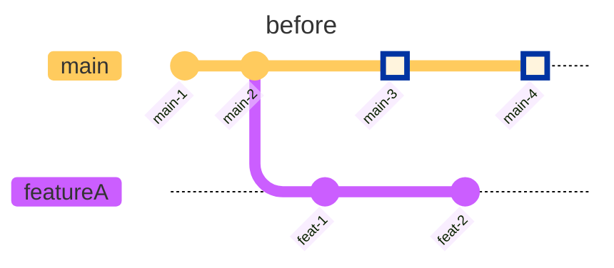
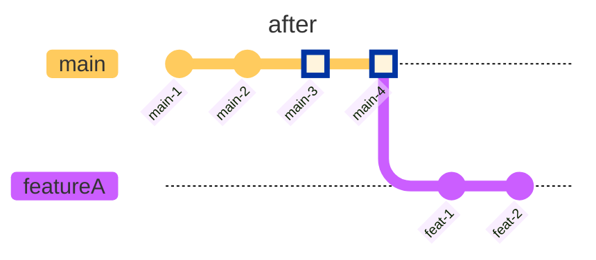

---
tags:
  - panel/3
---

# Introduction

This is a guide on how to rebase a branch called **"featureA"** over **"main"** branch.





# Lazygit

1. Go to the [[3. Local Branches]] panel.
    - Press `3`.
2. Hover over the **"featureA"** branch.
   - Use the `↓`/`↑` keys or a `single click`.
3. Checkout the **"featureA"** branch.
   - Press `space` or use a `double click`.
4. Hover over the **"main"** branch.
   - Use the `↓`/`↑` keys or a `single click`.
5. Rebase the **"featureA"** branch over the **"main"** branch.
   - Press `r`.
6. When prompted for confirmation, continue by pressing `enter` or cancel with `esc`.
   - [ ] Add #screenshot of rebase confirmation prompt.
7. If there are any [[merge conflicts]], resolve them.
   - [ ] Add #screenshot of **Auto-merge failed** notification

# Basic Terminal

1. First checkout the feature branch that you want to rebase

```bash
git checkout featureA
```

2. Then rebase it over **main** branch

```bash
git rebase main
```

3. If there are conflicts, you will need to resolve them before you can continue the rebase.

```bash
# To select changes done in base `main` branch
git checkout --ours <file>

# To select changes done in `featureA` branch
git checkout --theirs <file>

# or Manually edit the file to resolve the conflict
vim <file>
```

4. Once conflicts are resolved for a file, stage the file

```bash
git add <file>
```

5. Once all conflicts are resolved, continue the rebase

```bash
git rebase --continue
```

# See Also

- [[Resolving Merge Conflicts]]
